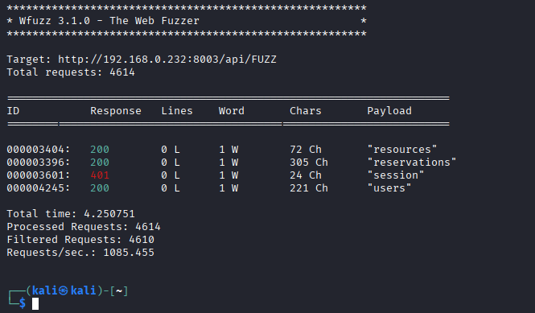

# Main Testing List

## 🧑‍🦲 Guest

### ✅ Can do
- Can view public resource list — `/resources`  
  - Observation: "Manage recources" page opens
  - Matches spec: ✅

- Can access login form — `/login`  
  - Observation: Login form opens normally
  - Matches spec: ✅

### ❌ Cannot do
- Cannot access reservation page — `/reservation`  
  - Observation: Shows status: "The process failed. Unauthorized".
  - Matches spec: ✅

- Cannot POST new reservation — `/api/reservations`  
  - Observation: API doesn't take new reservations, "unauthorized"
  - Matches spec: ✅

---

## 🧑‍💼 Reserver

### ✅ Can do
- Can book a resource — `/reservation` + `/api/reservations`  
  - Observation: Reserver can book reservation 
  - Matches spec: ✅

- Can view own profile page — `/profile`  
  - Observation: Profile page not found  
  - Matches spec: ❌

### ❌ Cannot do
- Cannot access admin user list — `/admin/users`  
  - Observation: "Not found" status
  - Matches spec: ✅

- Cannot delete other users — `/api/admin/users/:id`  
  - Observation: "Not found" status
  - Matches spec: ✅

---

## 🧑‍💼🛡️ Administrator

### ✅ Can do
- Can add a resource — `/admin/resources/new`  
  - Observation: "Not found" status
  - Matches spec: ❌

- Can manage all reservations — `/admin/reservations`  
  - Observation: "Not found" status
  - Matches spec: ❌

### ❌ Cannot do
- Cannot book a resource if system incorrectly blocks admins (bug?) — `/reservation`  
  - Observation: Admin can book resource. 
  - Matches spec: ❌

---

## 🔍 Notes
- Tested with browser, ZAP and wfuzz.  
- Zap report in Phase3 folder.
- Wfuzz screenshots below.

