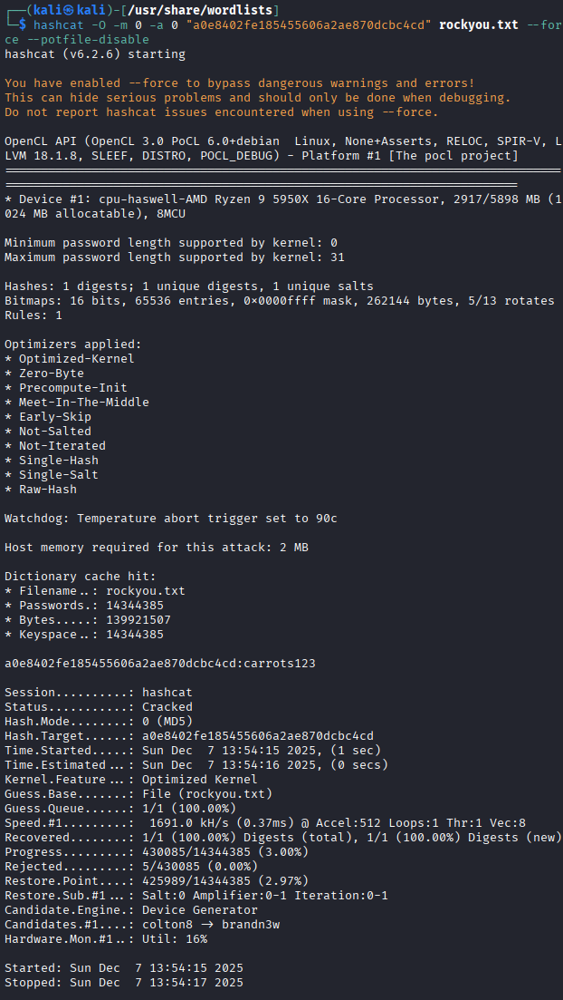
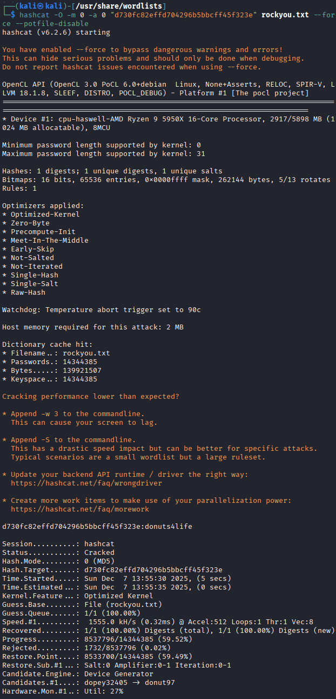
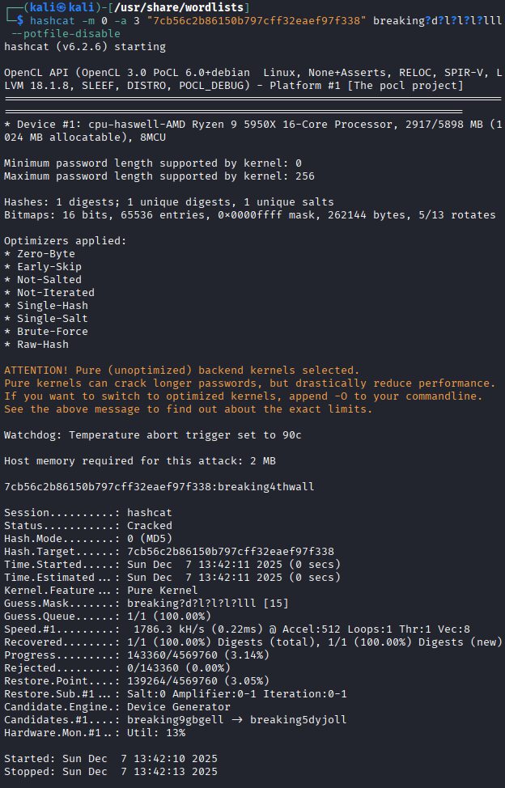
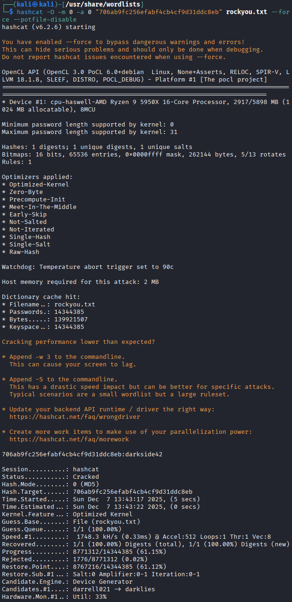

# Password Cracking Report

This assignment is included in Phase 2 of Booking System project.
I cracked five passwords from the database included in Phase 2 docker container.
I used Hashcat in Kali VM for cracking passwords from hashes visible in database.

## Crackings
These accounts and hashes is included in the database of this assignment.

Whatsupdoc's password can be cracked easily with hashcat dictionary attack and rockyou.txt due access to password database.

---

Doh's password crack succeeded with same method.

---

Darkknight's password exhausted hashcat when used with rockyou.txt. Beginning and lenght of the password was known so it is used with hashcat as "iamven?l?l?l?l?l?l" where "?l" means small character in range a-z.

---

Chimichanga's case where same as above, but there is one unknown number in known place "?d" and at the end two "l" characters.

---

Iamyourfathers case goes with rockyou.txt as like first two.

---
---

## Answers for questions

### What is the main difference between Dictionary and Non-Dictionary attacks?
Wordlists is used in dictionary attack, while Non-Dictionary goes true brute force trying all possible options.

### What advantage does an attacker gain by having access to the system’s database that reveals the users and the password hashes?
Attacker gain access to system and may be able to do privilege escalation, maybe even different systems with credentials stored in database. Attacker can also possibly perform identity thefts. Attacker can also bypass alarm triggers and lockouts working offline.

### What concrete security benefits are achieved by using longer passwords instead of shorter ones?
Longer passwords are harder to guess and take longer time to brute force.